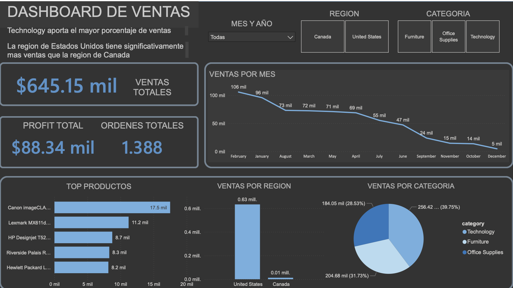

# Análisis de Ventas - Proyecto Data Analyst

## Descripción del Proyecto

Este proyecto consiste en el análisis de un dataset de ventas con el objetivo de identificar tendencias, productos más rentables, comportamiento de clientes y desempeño por región.

Se desarrolló un flujo completo de análisis de datos que incluye:

* Limpieza y transformación en SQL
* Análisis exploratorio
* Visualización en Power BI
* Generación de insights

---

## Herramientas Utilizadas

* SQL (MySQL)
* Power BI
* Excel / CSV
* GitHub

---

## Análisis Realizado

### Ventas y Rentabilidad

* Evaluación de ventas totales y profit
* Comparación entre regiones
* Identificación de pérdidas

### Productos

* Top productos por ventas y rentabilidad
* Subcategorías más relevantes
* Impacto de descuentos

### Clientes

* Clientes con mayor número de órdenes
* Identificación de clientes recurrentes

### Tendencias

* Análisis de ventas mensuales
* Identificación de picos de desempeño

---

## Dashboard

El dashboard fue desarrollado en Power BI e incluye:

* KPIs principales (ventas, profit, órdenes)
* Análisis por categoría y región
* Top productos
* Tendencias mensuales

### Vista previa

---

## Insights Clave

* Existen productos con alto volumen de ventas pero baja rentabilidad
* Algunas regiones generan mayor profit relativo
* Los descuentos impactan directamente en la rentabilidad
* Los clientes recurrentes representan una parte importante de los ingresos

---

## Conclusión

Este proyecto demuestra habilidades en:

* SQL para manipulación de datos
* Análisis exploratorio
* Visualización en Power BI
* Interpretación de resultados

---

## Contacto

* GitHub: https://github.com/ReneBedolla24
* LinkedIn: www.linkedin.com/in/rené-tovar-bedolla-5a9035204

---
